Features
===============================================================================

Project Discovery
-------------------------------------------------------------------------------

Ember.js projects are automatically discovered when imported via 
`File → New → Project from Existing Sources...`. The importer will look for an
`.ember-cli` file and will flag the project as an Ember.js project if the file
exists.

The language level for Ember.js projects is automatically set to ES6 and
JSHint support is enabled if a `.jshintrc` file is found.

Marking special folders
-------------------------------------------------------------------------------

The importer will mark certain folders like this:

- `app` as `Sources Root`
- `public` as `Resources Root`
- `tests`, `tests/unit` and `tests/integration` as `Tests Root`
- `dist` and `tmp` as `Excluded`

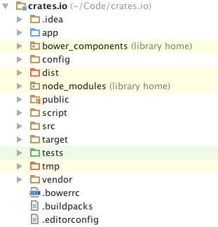

This will cause the "Packages" view to look like this:

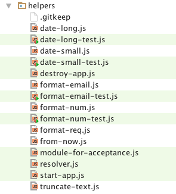

Quick Navigation
-------------------------------------------------------------------------------

### `Navigate → Class...`

The plugin is indexing all typical components in the `app` folder and is
providing them for quick access via the `Navigate → Class...` action. Currently
supported are:

- Adapters 
- Components
- Controllers
- Helpers
- Models
- Routes
- Serializers
- Services
- Transforms

The indexer will transform file paths into class names by capitalizing the
path parts and appending a type suffix

Example: `app/routes/pets/index.js` will be indexed as `PetsIndexRoute`

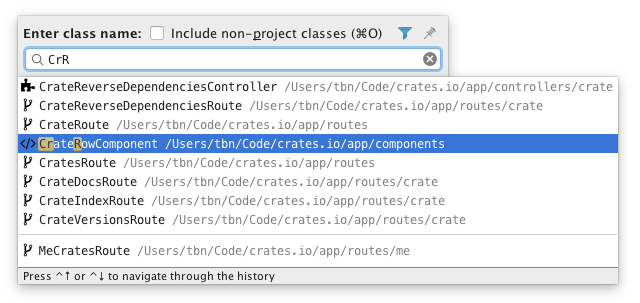

### `Navigate → Related Symbol...`

The plugin provides an implementation for the `Navigate → Related Symbol...`
quick navigation.

Example: Invoking the action inside of `/app/routes/crate/index.js` will
switch to the `/app/controllers/crate/index.js` file if it exists.
 
The following groups of files can be cycled like this:
 
- `controllers`, `routes`, `templates`
- `components`, `templates`
- `adapters`, `models`, `serializers`

The same functionality can also be used to cycle between tests and the tested
components (i.e. `/app/routes/crate/index.js` and 
`/tests/unit/routes/crate/index.js`)

### Navigating via references

Some Ember.js method calls result in container lookups and can not be resolved
statically. The Ember.js plugin implements a best effort reference resolver
for cases like `DS.belongsTo('user')`, where <kbd>ctrl</kbd>-clicking the
`'user'` literal will navigate directly to the `user` model if it exists.

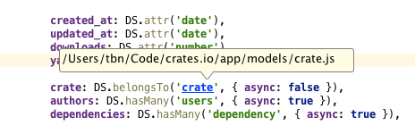

The same functionality also provides basic code completion via 
<kbd>ctrl</kbd> + <kbd>space</kbd>:

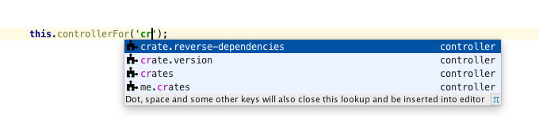

Have a look at the 
[`EmberReferenceContributor`](../src/main/kotlin/com/emberjs/psi/EmberReferenceContributor.kt) 
class to check for which methods this functionality is available.

#### References and Completion in Handlebars

The same code completion and reference functionality is also available inside
of Handlebars templates for the components and helpers in your project. Note
that this does not work for components/helpers imported from addons yet.

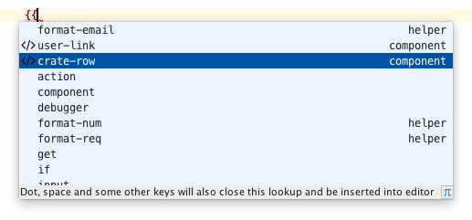

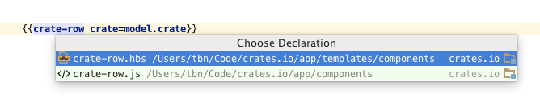

Using `ember-cli` from the IDE
-------------------------------------------------------------------------------

Some of the `ember-cli` commands are exposed right in the IDE for quick access.

### Creating a new project

A new Ember CLI project can be created through `File → New → Project...` and
then choosing `Static Web` and either `Ember CLI App` or `Ember CLI Addon`.

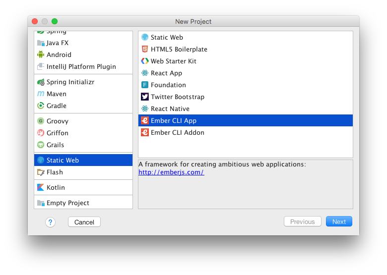

### Generating files

The Ember.js plugin can be used to quickly generate files using the `generate`
command of `ember-cli`. This functionality is available as 
`File → New → Ember.js Code`.

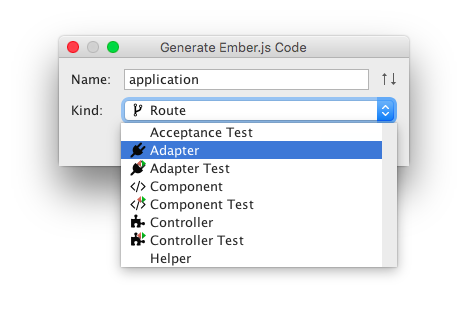

### Running the ember server

The plugin adds a `Ember Serve` 
[run configuration](https://www.jetbrains.com/help/idea/creating-and-editing-run-debug-configurations.html)
that allows you to launch a
[development server](https://guides.emberjs.com/v2.16.0/tutorial/ember-cli/#toc_the-development-server).
A new `Ember Serve` run configuration can be created through
`Run → Edit Configurations...`.

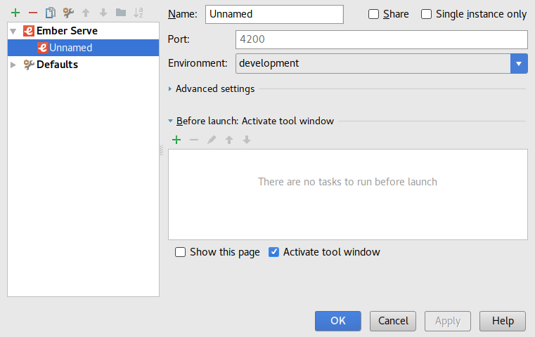

To configure advanced settings like the server host, proxy or ssl, expand the
`Advanced settings` panel.

### Running ember tests

This plugin also adds a `Ember Test` run configuration that will run your projects tests.
A new `Ember Test` run configuration can be created through
`Run → Edit Configurations...`.

To configure advanced settings like the server host, test filter or config file, expand the
`Advanced settings` panel.

Live Templates
-------------------------------------------------------------------------------

Live templates are snippets with variables that are automatically expanded by
the editor. For example: if you enter `comp` and press the <kbd>Tab</kbd> key
it will be expanded into a computed property:

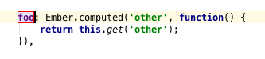

The following live templates are available:

- `alias` – computed property alias
- `comp` – computed property
- `compset` – computed property with setter
- `compx` – computed property method
- `test` – qunit test
- `pt` – pauseTest
- `then` – andThen

-------------------------------------------------------------------------------

Most screenshots in this document are taking from an import of the 
[crates.io](https://github.com/rust-lang/crates.io) project.
